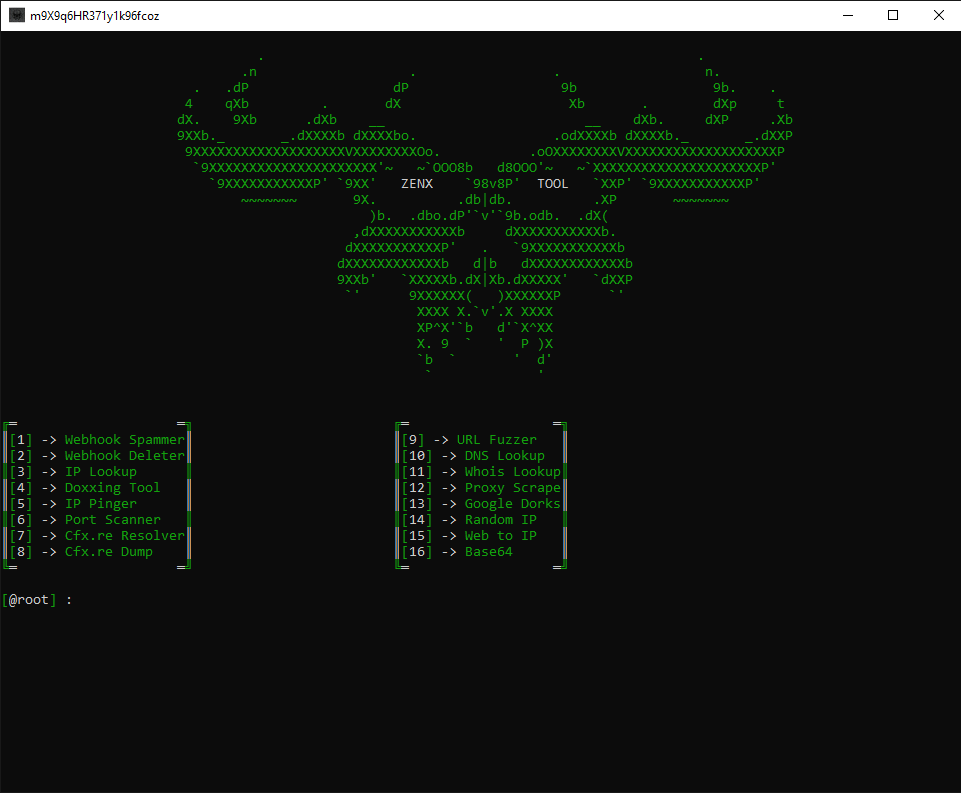

# ZenxTool

### Features

* ` Easy-to-use`
* ` Supports Windows Only`
* ` Url Fuzzer -> Find Hidden Directories//Files In Websites`
* ` Discord Webhook Tools -> Spammer & Deleter`
* ` IP Tools -> Lookup & Pinger & Port Scan`
* ` Doxxing & OSINT`
* ` Fivem Tools -> Resolver & Dump`
* ` DNS Lookup`
* ` Whois Lookup`
* ` Proxy Scrape`
* ` Google Dorks`
* ` Random IP`
* ` Web To IP`
* ` Base64 Encrypt & Decrypt`
---

### Libraries

* ` nlohmann::json`
* ` curl`
* ` base64`
* ` color.hpp`
---

## Preview

  

## Authors

- [@fano]()
